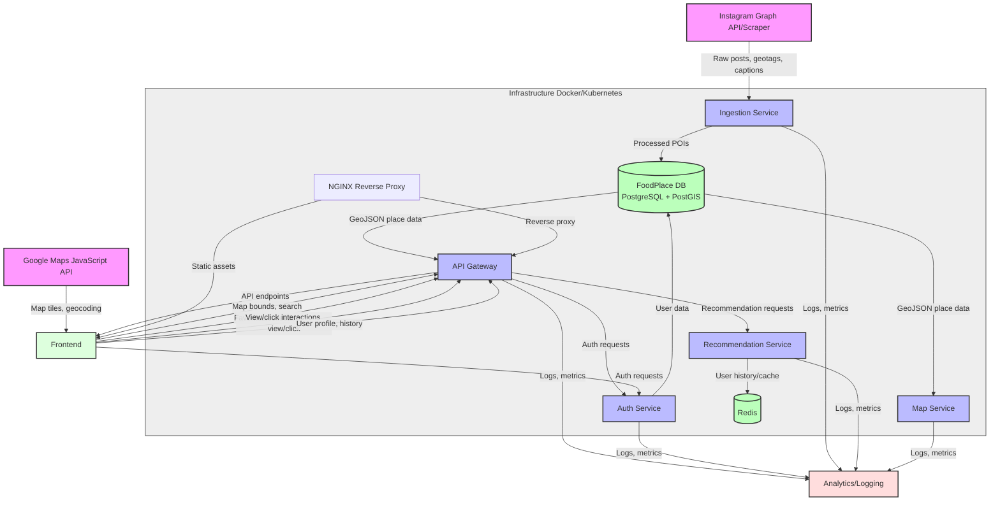

# Low-Level Design: Fooglemaps (Singapore Food Map)

## 1. Overview

Fooglemaps is a Google‑Maps‑style web application that aggregates food‑related posts from selected Instagram accounts, extracts location and cuisine information, stores them in a geospatial database, and displays points of interest on an interactive map. Users can search by cuisine, location (“near me”), and receive personalized recommendations based on their eating history.  
A lightweight OAuth‑based login lets users **save favorites, create collections, and view their history** across devices.

## 2. High-Level Architecture

### Components

| Component                  | Responsibility                                                                                                                                                              | Tech Stack                                                                                                                                                                                         |
| -------------------------- | --------------------------------------------------------------------------------------------------------------------------------------------------------------------------- | -------------------------------------------------------------------------------------------------------------------------------------------------------------------------------------------------- |
| **Ingestion Service**      | Polls Instagram (Graph API or scheduled scraper), parses captions & geotags, extracts cuisine tags via simple NLP (keyword lookup or lightweight ML model), persists to DB. | Python (FastAPI), `instaloader`/official Instagram Graph API, `spacy`/`nltk` for keyword matching, optional lightweight classifier.                                                                |
| **FoodPlace DB**           | Stores POIs with geometry, cuisine tags, timestamps, source post ID. Supports spatial queries (nearby, within polygon).                                                     | PostgreSQL + PostGIS extension. Table: `food_places(id PK, name, geom POINT, cuisine TEXT[], source_url TEXT, posted_at TIMESTAMP, raw_caption TEXT)`. Index on `geom` (GIST) and `cuisine` (GIN). |
| **API Gateway**            | Exposes REST/GraphQL endpoints for frontend: search, nearby, recommendations, detail view, user profile, favorites, collections.                                            | Node.js (Express) or FastAPI (Python). Thin wrapper; forwards to DB, Recommendation, or Auth services.                                                                                             |
| **Map Service**            | Serves map tiles (Leaflet/Google Maps JS) and provides marker data via API; optionally clusters markers.                                                                    | Frontend uses Google Maps JavaScript API; backend serves GeoJSON via `/api/places?bbox=...`.                                                                                                       |
| **Recommendation Service** | Generates personalized suggestions based on user’s view/click history (simple collaborative filtering or content‑based).                                                    | Python (FastAPI), Redis for caching user history, optional ML model (`scikit-learn`).                                                                                                              |
| **Auth Service**           | Handles OAuth2 login (Google, Apple, GitHub, etc.), issues JWT stateless tokens, manages user profile, favorites, collections.                                              | Node.js (Express/Passport) or FastAPI + `authlib`. Stores minimal user data in PostgreSQL.                                                                                                         |
| **Frontend**               | Interactive map UI, search bar, filters, user profile, history, favorites, collections.                                                                                     | React + TypeScript, Google Maps JavaScript API, Redux/Zustand for state, CSS (Tailwind or plain).                                                                                                  |
| **Analytics / Logging**    | Collects usage metrics, error logs.                                                                                                                                         | Winston (Node) or Python logging, optionally sent to ELK or cloud logging.                                                                                                                         |
| **Infrastructure**         | Docker containers orchestrated by Docker‑Com cloud logging.                                                                                                                 |
| **Infrastructure**         | Docker containers orchestrated by Docker‑Compose (local) or Kubernetes (prod).                                                                                              | Docker, PostgreSQL, Redis, NGINX reverse proxy.                                                                                                                                                    |

## 3. Data Model
